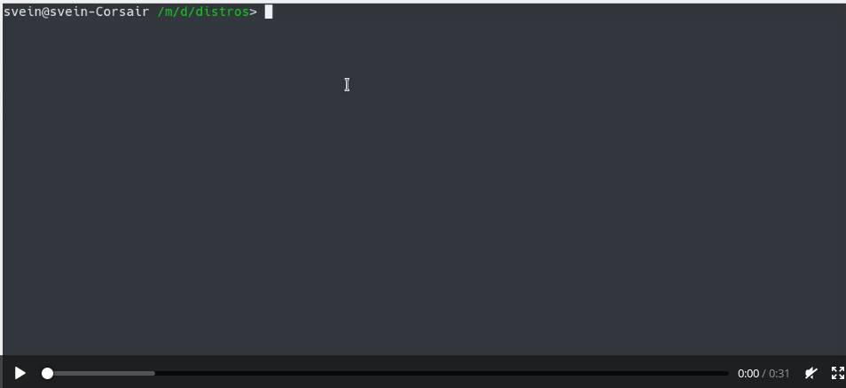

**Create a USB bootable device from an ISO image easily and [securely](#security).**

Don't want to messup with the system with `dd` command? Create a bootable USB from an ISO in one line.

### Synopsis

    bootiso [<options>...] <file.iso>

Note that **short POSIX options can be stacked** as of **v2.4.0**, like so: `-Jaybd /dev/sde`

### Examples

Provide the ISO as first argument and you'll be prompted to select from available USB drives amongst a list extracted from `lsblk`. If there is only one USB device connected, `bootiso` will automatically select it:

    bootiso myfile.iso

Or provide explicitly the USB device. Command fails and exit if the provided device is not USB, such as sata:

    bootiso -d /dev/sde myfile.iso

Add a [syslinux bootloader](https://en.wikipedia.org/wiki/SYSLINUX) for [non-hybrid ISOs](https://superuser.com/questions/683210/how-do-i-determine-if-an-iso-is-a-hybrid):

    bootiso -bd /dev/sde myfile.iso

Use `dd` instead of mount + `rsync`:

    bootiso --dd -d /dev/sde myfile.iso  

List available USB drives and exit:

    bootiso -l  

### Quick install

    curl -L https://rawgit.com/jsamr/bootiso/latest/bootiso -O
    chmod +x bootiso

Optionally, move the script to a bin path

    mv bootiso <bin-path>

Where `bin-path` is any folder in the `$PATH` environment such as `$HOME/bin`.

### Help the community

If you like `bootiso`, please help the community find it by **staring the project** and **upvoting those SE posts**:

- [How to create a bootable Ubuntu USB flash drive from terminal?](https://goo.gl/BNRmvm)
- [How to create a bootable USB from one ISO file securely from the shell?](https://goo.gl/YDBvFe)

### See it in action

#### Using `--assume-yes` + `--autoselect`

#### The selected device is not connected through USB

### Options

| Option&nbsp;(POSIX,&nbsp;short) | Option&nbsp;(GNU,&nbsp;long)&nbsp;&nbsp;&nbsp;&nbsp;&nbsp; | Description                                                                                                                                                                                                                                             |
| ------------------------------- | ---------------------------------------------------------- | ------------------------------------------------------------------------------------------------------------------------------------------------------------------------------------------------------------------------------------------------------- |
| `-h`                            | `--help`                                                   | Display a help message and exit.                                                                                                                                                                                                                        |
| `-v`                            | `--version`                                                | Display version and exit.                                                                                                                                                                                                                               |
| `-d <device>`                   | `--device <device>`                                        | Select <device> block file as USB device. If `<device>` is not connected through a USB bus, bootiso will fail and exit. Device block files are usually situated in `/dev/sXX` or `/dev/hXX`. You will be prompted to select a device if you don't use this option.        |
| `-b`                            | `--bootloader`                                             | Install a [syslinux bootloader](https://en.wikipedia.org/wiki/SYSLINUX) (safe mode) for non-hybrid ISOs. Does not work with `--dd` option.                                                                                                                                  |
| `-y`                            | `--assume-yes`                                             | bootiso won't prompt the user for confirmation before erasing and partitioning USB device. Use at your own risks.                                                                                                                                       |
| `-a`                            | `--autoselect`                                             | Enable autoselecting USB devices in conjunction with `-y` option. Autoselect will automatically select a USB drive device if there is exactly one connected to the system. Enabled by default when neither `-d` nor `--no-usb-check` options are given. |
| `-J`                            | `--no-eject`                                               | Do not eject device after unmounting.                                                                                                                                                                                                                   |
| `-l`                            | `--list-usb-drives`                                        | List available USB drives.                                                                                                                                                                                                                              |
| `-M`                            | `--no-mime-check`                                          | bootiso won't assert that selected ISO file has the right mime-type.                                                                                                                                                                                  |
| `-s`                            | `--strict-mime-check`                                      | Disallow loose application/octet-stream mime type in ISO file.                                                                                                                                                                                          |
|                                 | `--`                                                       | POSIX end of options.                                                                                                                                                                                                                                   |
|                                 | `--dd`                                                     | Use dd utility instead of mounting + rsync. Does not allow bootloader installation with syslinux.                                                                                                                                                       |
|                                 | `--no-usb-check`                                           | bootiso won't assert that selected device is a USB (connected through USB bus). Use at your own risks.                                                                                                                                                  |

<a name="security" />

### Security checks and robustness

✔ bootiso asserts that selected ISO has the correct mime-type and exit if it doesn't (with [file](https://askubuntu.com/a/3397/276357) utility).  
✔ bootiso asserts that selected device is connected through USB preventing system damages and exit if it doesn't (with [udevadm](https://askubuntu.com/a/168654/276357) utility).  
✔ bootiso asserts that selected item is not a partition and exit if it doesn't (with `lsblk`).  
✔ bootiso prompts the user for confirmation before erasing and paritioning USB device.  
✔ bootiso will handle any failure from a command properly and exit.  
✔ bootiso will call a cleanup routine on exit with `trap`.  
✔ bootiso is being carefully linted and validated with [shellcheck](https://www.shellcheck.net/) (see travis build status).

This script will also check for dependencies and prompt user for installation (works with `apt-get`, `yum`, `dnf`, `pacman`, `zypper`, `emerge`).

### What it does

This script walks through the following steps:

1. Request sudo.
2. Check dependencies and prompt user to install any missing.
3. If not given the `-M`, `--no-mime-check` option, assert that provided ISO exists and has the expected `application/x-iso9660-image` mime-type via `file` utiltiy. If the assertion fails, exit with error status.
4. If given the `-d`, `--device` option, check that the selected device exists and is not a partition. Otherwise, prompt the user to select a device and perform the above-mentioned controls.
5. If not given the `--no-usb-check` option, assert that the given device is connected through USB via `udevadm` utility. If the assertion fails, exit with error status.
6. If not given the `-y`, `--assume-yes` option, prompt the user for confirmation that data might be lost for selected device if he goes to next step.
7. Unmount the USB if mounted, blank it and delete existing partitions.
8. Create a FAT32 partition on the USB device.
9. Create a temporary dir to mount the ISO file and mount it.
10. Create a temporary dir to mount the USB device and mount it.
11. Copy files from ISO to USB device.
12. If option `-b`, `--bootloader` is selected, install a bootloader with syslinux in slow mode.
13. Unmount devices and remove temporary folders.
14. Eject USB device if `-J`, `--no-eject` is not selected

### Credits

This script was made after [this askubuntu post answer from Avinash Raj](https://askubuntu.com/a/376430/276357) to automate the described steps in a robust, secured way ([see the security section for more details](#security)).
