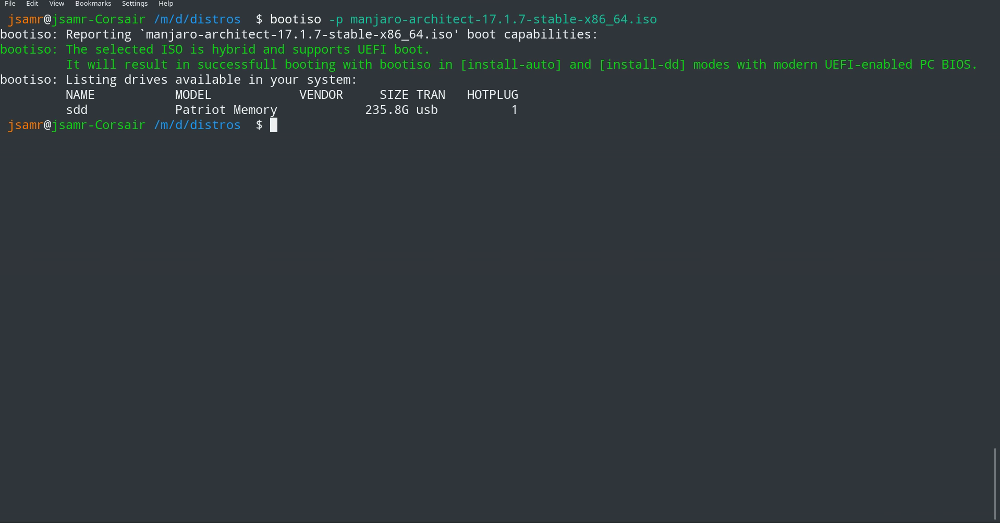
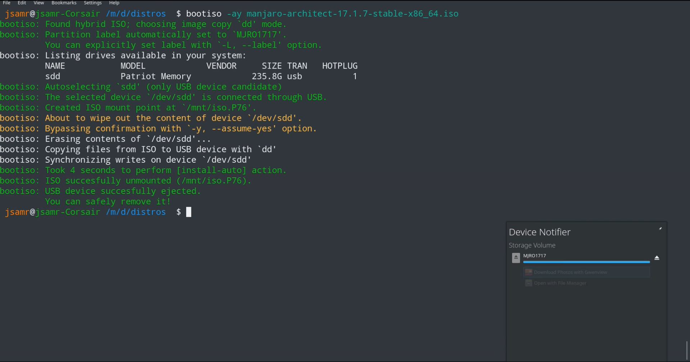
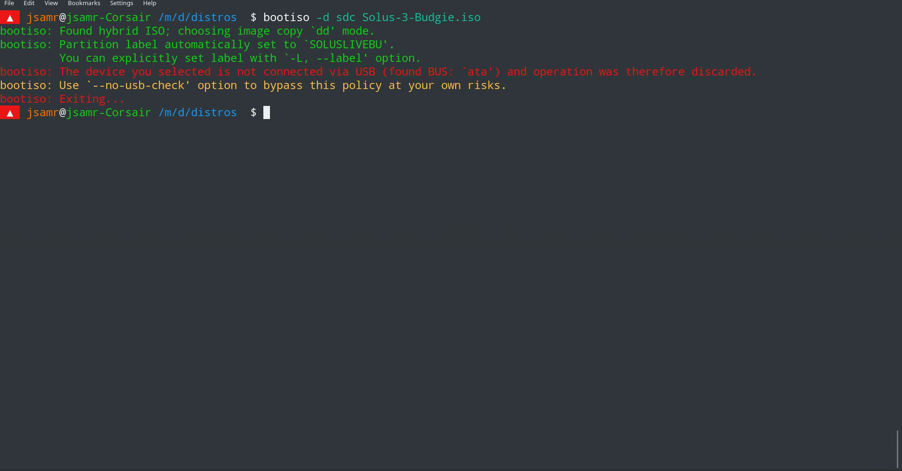

  

**Create a USB bootable device from an ISO image easily and [securely](#security).**

Don't want to messup the system with `dd` command? Create a bootable USB from an ISO in one line [[see it in action](#action)].

Works seamlessly with hybrid and non-hybrid ISOs (SYSLINUX or UEFI compliant) such as any linux ISO, Windows ISO or rescue live-cds like UltimateBootCD.
You don't have to tweak anything: `bootiso` inspects the ISO file and [chooses the best method to make your USB bootable](#auto).

### Synopsis

    bootiso [<modifiers>...] <file.iso>
    bootiso <action> [<modifiers>...] <file.iso>
    bootiso <action> [<modifiers>...]

The default action `[install-auto]` as per first synopsis is to install an ISO file to a USB device in
automatic mode. In such mode, bootiso will analyze the ISO file and select the best course of
actions to maximize the odds your USB stick be proven bootable (see [automatic mode behavior](#auto)).  
Other [`<modifiers>` and `<actions>` are listed in this bellow section](#flags).

### Examples

To have a quick feedback, `[probe]` around to check bootiso capabilities with given ISO file and list USB drives candidates [[watch video](https://webmshare.com/play/JZrVW)]:

    bootiso -p myfile.iso

With the default action `[install-auto]` [[read its detailed behavior here](#auto)], give the ISO as first argument and you'll be prompted to select from available USB drives amongst a list extracted from `lsblk`. If there is only one USB device connected, `bootiso` will automatically select it:

    bootiso myfile.iso

Or provide explicitly the USB device with `-d` flag. Command fails and exit if the provided device is not USB, such as sata [[watch video](https://webmshare.com/play/36rRn)]:

    bootiso -d sde myfile.iso

Avoid being promtped before writting to USB drive and autoselect device when there is exactly one [[watch video](https://webmshare.com/play/mw7Q4)]:

    bootiso -ay myfile.iso

List available USB drives and exit:

    bootiso -l

`[inspect]` the given ISO file and exit:

    bootiso -i myfile.iso

Quick-`[format]` the USB drive to NTFS and label it 'SAMUEL_SONY':

    bootiso -f -t ntfs -L 'SAMUEL_SONY'

Go to the [flags](#flags) section to see the full list of actions and modifiers.

### Quick install

    curl -L https://git.io/bootiso -O
    chmod +x bootiso

Optionally, move the script to a bin path

    mv bootiso <bin-path>

Where `bin-path` is any folder in the `$PATH` environment, preferably for superuser utilities such as `/usr/local/sbin/`.

Make sure to [follow our distro-dependent tweaks](#distro-tweaks) to have bootiso settled.

### Help the community

If you like `bootiso`, feel free to help the community find it by **staring the project** and **upvoting those SE posts**:

- [How to create a bootable Ubuntu USB flash drive from terminal?](https://goo.gl/BNRmvm)
- [How to create a bootable USB from one ISO file securely from the shell?](https://goo.gl/YDBvFe)

<a name="action"/>

### See it in action

#### Probing

`--probe` (shorten `-p`) gives you details about ISO boot capabilities and list available USB drives.

#### Using `--assume-yes` + `--autoselect`

`--assume-yes` (shorten `-y`) bypass prompting the user for overwritting USB device, and `--autoselect` (shorten `-a`) allow automatic selection of USB device when exactly one device is connected in combination with `--assume-yes`.

#### No-USB device failure

In the bellow example, the selected device with `--device` (shorten `-d`) flag is not connected through USB and `bootiso` fails.

<a name="flags"/>

### Flags

Note that **short POSIX flags can be stacked** as of **v2.4.0**, like so: `bootiso -Jaybd /dev/sde`

#### Actions

<a name="actions"/>
<table>
  <tr>
    <th>Action (POSIX&nbsp;short)&nbsp; </th>
    <th> Action (GNU,&nbsp;long)  &nbsp;&nbsp;&nbsp;&nbsp;&nbsp;&nbsp;&nbsp;&nbsp;&nbsp;&nbsp;&nbsp;&nbsp;&nbsp;&nbsp;&nbsp;&nbsp;&nbsp;&nbsp;&nbsp;&nbsp;&nbsp;&nbsp;&nbsp;&nbsp;&nbsp;&nbsp;&nbsp;&nbsp;&nbsp;&nbsp;&nbsp;&nbsp;&nbsp;&nbsp;&nbsp;&nbsp;&nbsp;&nbsp;&nbsp;&nbsp;&nbsp;&nbsp;&nbsp;&nbsp;&nbsp;&nbsp;&nbsp;</th>
    <th>Description</th>
    <th>Requires root</th>
  </tr>
  <tr>
        <td></td>
        <td></td>
        <td><code>[install-auto]</code>: Default action. Install ISO file in <a href="#auto">automatic mode</a>.</td>
        <td>yes</td>
  </tr>
  <tr>
      <td><code>-h</code></td>
      <td><code>--help</code></td>
      <td><code>[help]</code>: Display a help message and exit.</td>
      <td>no</td>
    </tr>
    <tr>
      <td><code>-v</code></td>
      <td><code>--version</code></td>
      <td><code>[version]</code>: Display version and exit.</td>
      <td>no</td>
    </tr>
    <tr>
      <td><code>-l</code></td>
      <td><code>--list-usb-drives</code></td>
      <td><code>[list-usb-drives]</code>: List available USB drives.</td>
      <td>no</td>
    </tr>
    <tr>
      <td><code>-i</code></td>
      <td><code>--inspect</code></td>
      <td><code>[inspect]</code>: Inspect ISO file boot capabilities and how <code>bootiso</code> can handle it, and check against a hash file if exists, then exit.</td>
      <td>yes</td>
    </tr>
    <tr>
      <td><code>-p</code></td>
      <td><code>--probe</code></td>
      <td><code>[probe]</code>: Equivalent to <code>[inspect]</code> followed by <code>[list-usb-drives]</code> actions.</td>
      <td>yes</td>
    </tr>
    <tr>
      <td><code>-f</code></td>
      <td><code>--format</code></td>
      <td><code>[format]: </code>Format USB drive.</td>
      <td>yes</td>
    </tr>
    <tr>
      <td></td>
      <td><code>--dd</code></td>
      <td><code>[install-dd]</code>: Overrides "automatic" mode and install ISO in image-copy mode with <code>dd</code> utility. It is recommended to run <code>[inspect]</code> action first.</td>
      <td>yes</td>
    </tr>
    <tr>
      <td></td>
      <td><code>--mrsync</code></td>
      <td><code>[install-mount-rsync]</code>: Overrides "automatic" mode and install ISO in mount-rsync mode with <code>rsync</code> utility. It is recommended to run <code>[inspect]</code> action first.</td>
      <td>yes</td>
    </tr>
</table>

#### Modifiers

<a name="options"/>
<table>
  <tr>
    <th>Modifier (POSIX&nbsp;short)&nbsp; </th>
    <th> Modifier (GNU,&nbsp;long)  &nbsp;&nbsp;&nbsp;&nbsp;&nbsp;&nbsp;&nbsp;&nbsp;&nbsp;&nbsp;&nbsp;&nbsp;&nbsp;&nbsp;&nbsp;&nbsp;&nbsp;&nbsp;&nbsp;&nbsp;&nbsp;&nbsp;&nbsp;&nbsp;&nbsp;&nbsp;&nbsp;&nbsp;&nbsp;&nbsp;&nbsp;&nbsp;&nbsp;&nbsp;&nbsp;&nbsp;&nbsp;&nbsp;&nbsp;&nbsp;&nbsp;&nbsp;&nbsp;&nbsp;&nbsp;&nbsp;&nbsp;</th>
    <th>Description</th>
    <th>Applicable actions &nbsp;&nbsp;&nbsp;&nbsp;&nbsp;&nbsp;&nbsp;&nbsp;&nbsp;&nbsp;&nbsp;&nbsp;&nbsp;&nbsp;&nbsp;&nbsp;&nbsp;&nbsp;&nbsp;&nbsp;&nbsp;&nbsp;&nbsp;&nbsp;&nbsp;&nbsp;&nbsp;&nbsp;&nbsp;&nbsp;&nbsp;&nbsp;&nbsp;&nbsp;&nbsp;&nbsp;&nbsp;&nbsp;&nbsp;&nbsp;&nbsp;&nbsp;&nbsp;&nbsp;&nbsp;&nbsp;&nbsp;&nbsp;&nbsp;&nbsp;&nbsp;&nbsp;</th>
  </tr>
    <tr>
      <td><code>-d &lt;device&gt;</code></td>
      <td><code>--device &lt;device&gt;</code></td>
      <td>Select <code>&lt;device&gt;</code> block file as USB device. If <code>&lt;device&gt;</code> is not connected through a USB bus, bootiso will fail and exit. Device block files are usually located in <code>/dev/sXX</code> or <code>/dev/hXX</code>. You will be prompted to select a device if you don&#39;t use this option. You can omit `/dev/` prefix.</td>
      <td><code>[install-*]</code>, <code>[format]</code></td>
    </tr>
    <tr>
      <td><code>-y</code></td>
      <td><code>--assume-yes</code></td>
      <td>bootiso won&#39;t prompt the user for confirmation before erasing and partitioning USB device. Use at your own risks.</td>
      <td><code>[install-*]</code>, <code>[format]</code></td>
    </tr>
    <tr>
      <td><code>-a</code></td>
      <td><code>--autoselect</code></td>
      <td>Enable autoselecting USB devices in combination with <code>-y</code> option. Autoselect will automatically select a USB drive device if there is exactly one connected to the system. Enabled by default when neither <code>-d</code> nor <code>--no-usb-check</code> modifiers are given.</td>
      <td><code>[install-*]</code>, <code>[format]</code></td>
    </tr>
    <tr>
      <td><code>-J</code></td>
      <td><code>--no-eject</code></td>
      <td>Do not eject device after unmounting.</td>
      <td><code>[install-*]</code></td>
    </tr>
    <tr>
      <td><code>-H</code></td>
      <td><code>--no-hash-check</code></td>
      <td>Do not search for hash files and check ISO integrity.</td>
      <td><code>[install-*]</code>, <code>[inspect]</code>, <code>[probe]</code></td>
    </tr>
    <tr>
      <td><code>-M</code></td>
      <td><code>--no-mime-check</code></td>
      <td>bootiso won&#39;t assert that selected ISO file has the right mime-type.</td>
      <td><code>[install-*]</code></td>
    </tr>
    <tr>
      <td><code>-t &lt;type&gt;</code></td>
      <td><code>--type &lt;type&gt;</code></td>
      <td>Format to <code>&lt;type&gt;</code> instead of default FAT32 (vfat). Supported types: vfat exfat ntfs ext2 ext3 ext4 f2fs.
      </td>
      <td><code>[install-mount-rsync]</code>, <code>[format]</code></td>
    </tr>
    <tr>
      <td><code>-L &lt;label&gt;</code></td>
      <td><code>--label &lt;label&gt;</code></td>
      <td>Set partition label as <code>&lt;label&gt;</code> instead of inferring.
      <code>bootiso</code> will cut labels which are too long regarding the selected filesystem limitations.
      </td>
      <td><code>[install-mount-rsync]</code>, <code>[format]</code></td>
    </tr>
    <tr>
      <td></td>
      <td><code>--</code></td>
      <td>POSIX end of options.</td>
      <td><code>[install-*]</code>, <code>[inspect]</code>, <code>[probe]</code></td>
    </tr>
    <tr>
      <td></td>
      <td><code>--no-usb-check</code></td>
      <td>bootiso won&#39;t assert that selected device is connected through USB bus. Use at your own risks.</td>
      <td><code>[install-*]</code>, <code>[format]</code></td>
    </tr>
    <tr>
      <td></td>
      <td><code>--no-size-check</code></td>
      <td>Prevent script from asserting that the device size is larger then the image.</td>
      <td><code>[install-*]</code></td>
    </tr>
    <tr>
      <td></td>
      <td><code>--no-wimsplit</code></td>
      <td>Prevent splitting sources/install.wim file in Windows ISOs.</td>
      <td><code>[install-*]</code></td>
    </tr>
    <tr>
      <td></td>
      <td><code>--hash-file &lt;file&gt;</code></td>
      <td>Specify file containing the ISO hash. Other files will not be checked.</td>
      <td><code>[install-*]</code>, <code>[inspect]</code>, <code>[probe]</code></td>
    </tr>
    <tr>
      <td></td>
      <td><code>--force-hash-check</code></td>
      <td>Fail and exit when no valid hash is found.</td>
      <td><code>[install-*]</code></td>
    </tr>
    <tr>
      <td></td>
      <td><code>--local-bootloader</code></td>
      <td>Prevent download of remote bootloader and force local (SYSLINUX) during installation.</td>
      <td><code>[install-mount-rsync]</code>, <code>[install-auto]</code></td>
    </tr>
    <tr>
      <td></td>
      <td><code>--remote-bootloader &lt;version&gt;</code></td>
      <td>Force download of remote bootloader at version <code>&lt;version&gt;</code>. Version must follow the pattern MAJOR.MINOR. Examples: 4.10, 6.04.</td>
      <td><code>[install-mount-rsync]</code>, <code>[install-auto]</code></td>
    </tr>
    <tr>
      <td><code><s>-b</s></code></td>
      <td><code><s>--bootloader</s></code></td>
      <td>Removed in v3.0.0. SYSLINUX installation is now automated.</td>
    </tr>    
</table>                                                                           

<a name="security" />

### Security checks and robustness

✔ `bootiso` inspects ISO file to find [the best strategy](#auto) resulting in a booting USB stick  
✔ `bootiso` check the ISO file hash sum against a hash file if one found. Supported hash algorithms are md5, sha1, sha256 and sha512.
✔ `bootiso` asserts that selected ISO has the correct mime-type and exit if it doesn't (with [file](https://askubuntu.com/a/3397/276357) utility).  
✔ `bootiso` asserts that selected device is connected through USB preventing system damages and exit if it doesn't (with [udevadm](https://askubuntu.com/a/168654/276357) utility).  
✔ `bootiso` asserts that selected item is not a partition and exit if it doesn't (with `lsblk`).  
✔ `bootiso` asserts that selected image is not larger than selected device.  
✔ `bootiso` prompts the user for confirmation before erasing and paritioning USB device.  
✔ `bootiso` will handle any failure from a command properly and exit.  
✔ `bootiso` will call a cleanup routine on exit with `trap`.  
✔ `bootiso` is being carefully linted and validated with [`shellcheck`](https://www.shellcheck.net/) (see [code quality status from codacy](https://app.codacy.com/app/jsamr/bootiso/dashboard)) and formatted with `shfmt`.

This script will also check for dependencies and prompt user for installation (works with `apt-get`, `yum`, `dnf`, `pacman`, `zypper`, `emerge`).

<a name="auto" />

### Automatic mode behavior

With default `[install-auto]` action, `bootiso` will inspect the ISO file and choose the best strategy to end up with a bootable USB stick.  
99% of the time, you shouldn't enforce any strategy and let `bootiso` choose.

The main decision is to pick up image-copy or mount+rsync modes.
In image-copy `dd` mode (enforcable with `[install-dd]` action, `--dd` flag), `bootiso` uses `dd` utility to make a raw copy of the ISO.
This is perfectly appropriate when the ISO file is aimed both at disk drives and CDs. Those ISO are called [hybrids](https://superuser.com/questions/683210/how-do-i-determine-if-an-iso-is-a-hybrid).

In mount+rsync mode (enforcable with `[install-mount-rsync]` action, `--mrsync` flag), `bootiso` creates one partition with MBR table in the USB drive and copy files from mounted ISO.
It will also install SYSLINUX bootlaoder if configuration files are found, which will allow legacy BIOS boot. When local version doesn't match ISO version, it will attempt to download the closest version available in [kernel.org](https://mirrors.edge.kernel.org/pub/linux/utils/boot/syslinux/Testing) if `--local-bootloader` flag is not set.

### Environment variables and distro-specific tweaks

#### Variables

- `SYSLINUX_LIB_ROOT`: set syslinux assets root, where mbr will be searched.

<a name="distro-tweaks">

#### Distros tweaks

- On Fedora, set `SYSLINUX_LIB_ROOT` env to `/usr/share/syslinux`

### Credits

This script was made after [this askubuntu post answer from Avinash Raj](https://askubuntu.com/a/376430/276357) to automate the described steps in a robust, secured way ([see the security section for more details](#security)).
